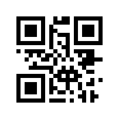
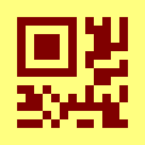

# qrcode-rs

[](https://github.com/houseme/qrcode-rs/actions?query=workflow%3ABuild)
[](https://crates.io/crates/qrcode-rs)
[](https://docs.rs/qrcode-rs/)
[](./LICENSE-APACHE)
[](https://crates.io/crates/qrcode-rs)

`qrcode-rs` is a Rust crate for generating QR Code and Micro QR Code symbols, rendering them in multiple output formats, and optionally decoding them back through [`rqrr`](https://crates.io/crates/rqrr).

It is designed to cover the common cases well out of the box while still exposing lower-level building blocks for advanced encoding workflows such as fixed versions, mode forcing, GS1/FNC1 payloads, structured payload helpers, and custom rendering.

- Documentation: [docs.rs/qrcode-rs](https://docs.rs/qrcode-rs/)
- Crate page: [crates.io/crates/qrcode-rs](https://crates.io/crates/qrcode-rs)
- Repository: [github.com/houseme/qrcode-rs](https://github.com/houseme/qrcode-rs)

## Highlights

- Encode standard QR Code and Micro QR Code symbols.
- Use simple constructors, an ergonomic builder API, or batch generation helpers.
- Render to terminal text, Unicode, ANSI, SVG, PNG, EPS, PIC, HTML, and PDF.
- Generate structured payloads for URLs, plain text, WiFi credentials, vCards, and GS1 data.
- Parse WiFi, vCard, and GS1 QR payloads back into typed data structures.
- Add accessible alt text and ARIA labels for SVG and HTML output.
- Opt into `serde`, CLI support, async rendering, streaming, lightweight logging, and `rqrr`-based decoding via feature flags.
- Use the 2.0 split crates directly when a library needs only core, render, parse, decode, or one backend layer.
- Run without default features for lean `no_std + alloc` usage.

## Installation

Use the default feature set if you want the most common renderers enabled:

```toml
[dependencies]
qrcode-rs = "2.0"
```

If you only need the core encoder and want to avoid the default rendering stack:

```toml
[dependencies]
qrcode-rs = { version = "2.0", default-features = false }
```

Enable only the pieces you need:

```toml
[dependencies]
qrcode-rs = { version = "2.0", default-features = false, features = ["std", "svg", "serde"] }
```

### Feature Flags

| Feature | Purpose |
| --- | --- |
| `default` | Enables `std`, `image`, `svg`, `pic`, `eps`, `html`, and `pdf`. |
| `std` | Links the standard library. Disable for `no_std + alloc`. |
| `image` | Raster image rendering, including PNG workflows. |
| `svg`, `pic`, `eps`, `html`, `pdf` | Individual renderer backends. |
| `serde` | `Serialize` / `Deserialize` support for core QR data types. |
| `log` | Emits encoder diagnostics through the `log` crate. |
| `async` | Enables Tokio-backed async rendering helpers. |
| `cli` | Builds the `qrencodes` command-line tool. |
| `decode-rqrr` | Enables decoding through `rqrr`. |
| `compat-1x` | Keeps the 1.x facade API available during the 2.0 migration. |

## Workspace Crates

`qrcode-rs` remains the recommended facade for applications. The 2.0 release
also publishes smaller crates for libraries that need a narrower dependency
surface:

| Crate | Use it when you need |
| --- | --- |
| `qrcode-core` | Core encoding types, module views, traits, and plugin contracts. |
| `qrcode-render` | Shared render traits, text/Unicode/ANSI/image helpers, and color utilities. |
| `qrcode-parse` | WiFi, vCard, and GS1 payload parsing without the facade. |
| `qrcode-decode` | Decoder traits, grayscale views, Structured Append parsing, and the optional `rqrr` adapter. |
| `qrcode-svg`, `qrcode-eps`, `qrcode-pic`, `qrcode-html`, `qrcode-pdf` | Individual renderer backends. |

For example:

```toml
[dependencies]
qrcode-core = "2.0"
qrcode-svg = "2.0"
```

`qrcode-compat` is a workspace-local migration harness and is not published.

## Quick Start

### Render a PNG

```rust
use image::Luma;
use qrcode_rs::QrCode;

fn main() {
    let code = QrCode::new(b"https://example.com").unwrap();
    let image = code
        .render::<Luma<u8>>()
        .min_dimensions(256, 256)
        .build();

    image.save("/tmp/qrcode.png").unwrap();
}
```

Generates:



### Builder API with a fixed error-correction level

```rust
use qrcode_rs::{EcLevel, QrCode};
use qrcode_rs::render::unicode;

fn main() {
    let code = QrCode::builder("https://example.com")
        .ec_level(EcLevel::H)
        .build()
        .unwrap();

    let terminal = code
        .render::<unicode::Dense1x2>()
        .quiet_zone(false)
        .build();

    println!("{terminal}");
}
```

### Generate a Micro QR SVG

```rust
use qrcode_rs::{EcLevel, QrCode, Version};
use qrcode_rs::render::svg;

fn main() {
    let code = QrCode::with_version(b"01234567", Version::Micro(2), EcLevel::L).unwrap();
    let image = code
        .render::<svg::Color>()
        .min_dimensions(200, 200)
        .dark_color(svg::Color("#800000"))
        .light_color(svg::Color("#ffff80"))
        .build();

    println!("{image}");
}
```

Preview:

[](docs/images/test_annex_i_micro_qr_as_svg.svg)

## Common Encoding Helpers

`qrcode-rs` includes convenience constructors for common payload types:

- `QrCode::for_url(...)`
- `QrCode::for_text(...)`
- `QrCode::for_wifi(ssid, password, auth)`
- `QrCode::for_vcard(name, phone, email)`
- `QrCode::for_gs1(...)`
- `QrCode::new_micro(...)`
- `QrCode::batch(inputs, ec_level)`

Example:

```rust
use qrcode_rs::QrCode;

fn main() {
    let wifi = QrCode::for_wifi("GuestNetwork", "p\\;ss", "WPA").unwrap();
    let contact = QrCode::for_vcard("Ada Lovelace", "+15551234", "ada@example.org").unwrap();

    println!("wifi width = {}", wifi.width());
    println!("contact width = {}", contact.width());
}
```

## Structured Payload Parsing

The `parse` module can turn QR payload text back into typed domain objects:

```rust
use qrcode_rs::parse::wifi::WifiConfig;

fn main() {
    let payload = r#"WIFI:T:WPA;S:GuestNetwork;P:p\;ss;H:false;;"#;
    let cfg = WifiConfig::parse(payload).unwrap();

    assert_eq!(cfg.ssid(), "GuestNetwork");
    assert_eq!(cfg.security().as_str(), "WPA");
    assert!(!cfg.hidden());
}
```

There are also parsers and examples for:

- `parse::vcard::VCard`
- `parse::gs1::Gs1Result`

## Accessible Output

For web and document workflows, the crate includes helpers to describe QR codes accessibly:

```rust
use qrcode_rs::QrCode;
use qrcode_rs::render::svg;

fn main() {
    let payload = "https://example.com";
    let code = QrCode::new(payload).unwrap();
    let raw_svg = code.render::<svg::Color>().build();
    let labeled_svg = svg::aria_label(&raw_svg, &QrCode::alt_text(payload));

    println!("{labeled_svg}");
}
```

## Decoding with `rqrr`

Enable `decode-rqrr` to bridge generated or external grayscale QR images back into data:

```toml
[dependencies]
qrcode-rs = { version = "2.0", features = ["decode-rqrr"] }
```

```rust
use image::Luma;
use qrcode_rs::decode::rqrr::RqrrDecoder;
use qrcode_rs::decode::{GrayPixels, QrDecoder};
use qrcode_rs::QrCode;

fn main() {
    let payload = b"https://example.com/decode-bridge";
    let code = QrCode::new(payload).unwrap();
    let image: image::GrayImage = code.render::<Luma<u8>>().min_dimensions(200, 200).build();

    let decoded = RqrrDecoder::new().decode(GrayPixels::from(&image)).unwrap();
    assert_eq!(decoded[0].data(), payload);
}
```

## Command-Line Tool

Enable the `cli` feature to build the bundled `qrencodes` binary:

```bash
cargo install qrcode-rs --features cli
```

Basic usage:

```bash
qrencodes "https://example.com"
qrencodes -f svg -o out.svg "https://example.com"
qrencodes -f png -o out.png --size 12 --dark '#1a1a2e' --light '#f5f5dc' "Hello"
printf 'piped input' | qrencodes -f unicode
qrencodes --batch ./payloads.txt -f svg -o ./out
```

Supported output formats:

- `string`
- `unicode`
- `ansi`
- `svg`
- `png`
- `eps`
- `pic`
- `html`
- `pdf`

See the full help with:

```bash
cargo run --features cli -- --help
```

## More Examples

The [`examples/`](examples) directory covers the main workflows in this crate:

- Rendering: `encode_image`, `encode_svg`, `encode_html`, `encode_eps`, `encode_pic`, `encode_string`
- Advanced encoding: `encode_eci`, `encode_kanji`, `encode_fnc1`, `const_version`, `typed_encoding_mode`, `structured_append`
- Structured payloads: `parse_wifi`, `parse_vcard`, `parse_gs1`, `stream_codes`
- Plugins and async: `plugin_plain_text`, `plugin_invert_modules`, `async_render`
- Accessibility and styling: `accessible_svg`, `custom_colors`, `color_spaces`, `cmyk_print`, `batch_template`, `alt_text`
- Decoding and errors: `decode_roundtrip`, `error_handling`
- CLI patterns: `cli_tool`

## Migration

For the 1.x to 2.0 upgrade path, see [MIGRATION-1.x-to-2.0.md](MIGRATION-1.x-to-2.0.md). The `compat-1x` feature keeps the legacy facade available while call sites move to the builder, module-view, streaming, and split-crate APIs.

## License

Licensed under either of:

- Apache License, Version 2.0, ([LICENSE-APACHE](LICENSE-APACHE) or <http://www.apache.org/licenses/LICENSE-2.0>)
- MIT license ([LICENSE-MIT](LICENSE-MIT) or <http://opensource.org/licenses/MIT>)

at your option.

## Contributing

See [CONTRIBUTING.md](CONTRIBUTING.md) for development and contribution guidelines, including the local property-test, differential-test, and fuzzing commands used by CI.

Unless you explicitly state otherwise, any contribution intentionally submitted for inclusion in the work by you, as defined in the Apache-2.0 license, shall be dual licensed as above, without any additional terms or conditions.

## Acknowledgements

Thanks to [Kennytm](https://github.com/kennytm). This crate is based on [`qrcode-rust`](https://github.com/kennytm/qrcode-rust).
